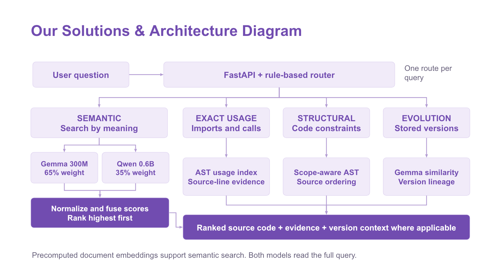

# PRISM Agentic Code Intelligence

Samsung PRISM GenAI Hackathon 3.0, Theme 1: Agentic Code Intelligence.

PRISM finds and ranks existing Python code for natural-language questions. A rule-based router selects semantic, exact-usage, structural or version retrieval. The browser interface shows ranked snippets and the evidence available for each route.

## Submission

**Team:** SRM_Team Ctrl Alt Elite_1

**Institution:** SRM Institute of Science and Technology

| Member | Role | Email |
| --- | --- | --- |
| Devansh Singh | Team Lead | ds8467@srmist.edu.in |
| Sankalp Kumar | Team Member | sk4156@srmist.edu.in |
| Ved Kumar | Team Member | vk9977@srmist.edu.in |
| Shreel Singh | Team Member | ss9735@srmist.edu.in |

- [Final presentation](submission/SRM_Team_Ctrl_Alt_Elite_1_Submission.pptx)
- [Signed AI disclosure (PDF)](submission/SRM_Team_Ctrl_Alt_Elite_1_AI_Disclosure.pdf) · [Editable Word copy](submission/SRM_Team_Ctrl_Alt_Elite_1_AI_Disclosure.docx)
- [Demo video (4 minutes 49 seconds)](https://drive.google.com/file/d/1Xe8Nz8a73yBgCInpAZProjbVSwcQ25Yj/view?usp=sharing)
- [Submission release and evaluation files](https://github.com/SinghDevansh-2006/prism-code-intelligence/releases/tag/PRISM_GENAI_HACKATHON_Y2026)

The tagged repository contains the source, requirements, runtime indexes, final presentation, signed disclosure and evaluation files. The video is hosted on Drive. No APK or SDK is required for this browser-based Python application.

## Setup

Use Git and Python 3.11. Semantic and version retrieval need internet access on first use to download pretrained models. Accept access terms for [google/embeddinggemma-300m](https://huggingface.co/google/embeddinggemma-300m) with your own Hugging Face account before authenticating. Model weights and access tokens are not bundled.

### macOS or Linux

```bash
git clone https://github.com/SinghDevansh-2006/prism-code-intelligence.git
cd prism-code-intelligence
git checkout PRISM_GENAI_HACKATHON_Y2026
python3.11 -m venv .venv
source .venv/bin/activate
python -m pip install -r requirements.txt
hf auth login
./run_demo.sh
```

The launcher starts the API, warms the semantic models and opens http://127.0.0.1:8000/. It may take several minutes to download and load the models on first use. Model loading needs sufficient free RAM and disk space; no minimum hardware benchmark is claimed.

### Windows PowerShell

```powershell
git clone https://github.com/SinghDevansh-2006/prism-code-intelligence.git
cd prism-code-intelligence
git checkout PRISM_GENAI_HACKATHON_Y2026
py -3.11 -m venv .venv
.\.venv\Scripts\python.exe -m pip install -r requirements.txt
.\.venv\Scripts\hf.exe auth login
$env:PRISM_DEVICE = "cpu"
.\.venv\Scripts\python.exe -m uvicorn api:app --host 127.0.0.1 --port 8000
```

Open http://127.0.0.1:8000/ manually. The first semantic or version query loads its models. These commands use the virtual environment directly, avoiding PowerShell activation-policy changes.

### Docker on CPU

```bash
docker build -t prism-ui .
docker run --rm -p 8000:8000 -e HF_TOKEN -v prism-hf:/root/.cache/huggingface prism-ui
```

Set `HF_TOKEN` in your shell to your own authorized Hugging Face token before running the container. Do not commit it. The volume retains downloaded models between runs. Exact-usage and structural queries can use the bundled indexes without model downloads.

### Startup troubleshooting

- **Access denied for EmbeddingGemma:** Accept its access terms, then log in with the same Hugging Face account.
- **Port 8000 is occupied:** Stop the other service, or run `python -m uvicorn api:app --host 127.0.0.1 --port 8001` and open that port.
- **First search is slow:** Allow model downloads and loading to finish. Inspect the terminal for download, memory or authentication errors.
- **Launcher diagnostics:** `run_demo.sh` writes API logs to the system temporary directory as `prism_api_<port>.log`. Set `PRISM_OPEN_BROWSER=0` on headless machines.
- **Stopping:** A manually started Uvicorn server stops with Ctrl+C. The demo launcher starts a background server; stop that process before changing its device or port configuration.

## Example Queries

Semantic:

    Find code that validates a tic-tac-toe board state

Exact usage:

    which files import math?

Structural:

    which functions call range before print?

Evolutionary:

    show API version history


## Architecture



Semantic retrieval independently scores the corpus with both embedding models. Each model receives the full query. Its normalized query embedding is compared with stored document embeddings using a dot product. Each model’s document scores are then standardized per query, and the two standardized scores are combined:

- 65% EmbeddingGemma
- 35% Qwen3-Embedding-0.6B

```text
z_model = (score_model - mean(scores_model)) / (std(scores_model) + 1e-8)
fusion_score = 0.65 * z_gemma + 0.35 * z_qwen
```

Results are sorted by descending fusion score. Rank 1 is the highest-scoring match under this method, not a guarantee that the code is correct or best for every use. The weights apply to scores, not portions of the query. Exact-usage and structural routes use their own evidence scores. Router confidence is a heuristic, not a calibrated probability.

The engine also measures retrieval confidence. Confidence-gated cross-encoder reranking was experimentally evaluated, but dense fusion remains the screening retrieval configuration because reranking did not improve held-out AppsRetrieval NDCG@10.


## Retrieval Results

### Private Validation

The private validation split contains 1,000 queries sampled deterministically from the provided training data. Each validation query retrieves against all 5,000 training documents.

| System | NDCG@10 | MRR | Recall@10 |
| --- | ---: | ---: | ---: |
| Qwen3-Embedding-0.6B | 0.8215 | 0.7946 | 0.914 |
| EmbeddingGemma | 0.8716 | 0.8493 | 0.947 |
| Dual dense fusion | 0.9177 | 0.9004 | 0.973 |
| Fusion + selective reranker | 0.9204 | 0.9038 | 0.974 |

### AppsRetrieval Test Split

Frozen dense fusion evaluated over 3,765 AppsRetrieval test queries against all 8,765 corpus documents:

| Metric | Score |
| --- | ---: |
| NDCG@10 | 0.853100 |
| MRR@10 | 0.821803 |
| Recall@10 | 0.949535 |
| Recall@20 | 0.973440 |
| Recall@100 | 0.993625 |

These scores come from the repository's local evaluation pipeline over the AppsRetrieval test split and qrels.

No model weights, fusion weights, gate thresholds, or reranking parameters were tuned from these test results.

### Benchmark Verification

The values reported above are the canonical metrics recomputed directly from the exact ordered submission artifact.

Verify them with:

    python verify_submission.py

The verifier loads the official AppsRetrieval test qrels and independently computes NDCG@10, MRR@10, MRR@100, Recall@10, Recall@20, and Recall@100 from the submitted top-100 rankings.

Submission artifact SHA-256:

    519fe7b0ad8bb4ae80f1da5192ceea067bc1c68b74cad6328ee7ac8a2de644d4

Because the submission file contains an explicit ranking order, these artifact-derived metrics are the values used in the README and demo UI. Score-based evaluation can differ slightly when retrieval scores are tied because of tie-order conventions.

The ranked inference artifact is:

    submission/AppsRetrieval_inference_results.json

It contains all 3,765 test queries with the top 100 ranked corpus IDs for each query.


## Retrieval Routes

The deterministic router checks version-history patterns first, then structural patterns, then exact-usage patterns. Other queries use semantic retrieval. It chooses one route per request.

### 1. Semantic Retrieval

Used for descriptive intent such as:

    Find code that validates a tic-tac-toe board state

Execution flow:

    query
      -> EmbeddingGemma
      -> Qwen3-Embedding
      -> normalize score distributions
      -> 65/35 fusion
      -> confidence measurement
      -> ranked code snippets

### 2. Exact Usage Search

Used for explicit symbol, API, function, or import questions such as:

    which files import math?

The engine searches AST-derived metadata and returns matching source evidence. Identifier matching is case-sensitive and respects symbol boundaries. Import questions require import evidence; function-call questions require a call in a function scope. This is static name matching, not complete alias resolution.

### 3. Structural Retrieval

Used for structural relationships such as:

    which functions call range before print?

The structural index records calls, imports, functions, classes and line numbers within their scopes. It checks source ordering, recursion and nested-loop constraints. Unsupported call/dependency graph requests return an explanatory error. Source order does not establish runtime execution order.

### 4. Evolutionary Retrieval

Used for version-history questions such as:

    show API version history

The version-aware index stores:

- logical code identity
- version
- embedding
- previous-version similarity
- change classification
- code

The default `runtime_index/git-history` contains real `api.py` revisions across seven bounded repository snapshots, matching the recorded demo. This is not historical APPS ground truth or a full-repository index. Legacy synthetic fixtures remain for the original experiment scripts. To index your own Git history into a separate index:

```bash
python index_git_history.py --repo . --path api.py --max-commits 20 --output cache/git-history
PRISM_VERSION_INDEX=cache/git-history python -m uvicorn api:app --host 127.0.0.1 --port 8000
```

On PowerShell, set `$env:PRISM_VERSION_INDEX="cache/git-history"` before starting the API. Stop an existing server before changing its index. Ask a history question such as `show API version history`.

The importer reads bounded first-parent history without checkout or code execution. It records commit IDs, paths, edits and deletions, skips already indexed versions and reuses identical embeddings. The oldest selected revision is a baseline when earlier commits are outside the window. Deleted code remains searchable in its historical versions; deletion markers appear in history but are not code results. The default history route searches all historical versions; explicit latest and selected-commit scopes are available. Renames are separate file identities. Appending older or divergent history is rejected; use a new output directory for a different branch or a wider historical window. Use one repository and one writer per output index; it is not a concurrent database or crash-proof transaction store.


## API

Run manually:

    uvicorn api:app --host 127.0.0.1 --port 8000

Health endpoint:

    GET /health

Search endpoint:

    POST /search

Example request:

    curl -X POST http://127.0.0.1:8000/search \
      -H "Content-Type: application/json" \
      -d '{"query":"which functions call range before print?","top_k":5}'

The response includes:

- selected route
- routing reason
- router confidence
- execution strategy
- execution steps
- retrieval latency
- ranked code
- AST evidence when applicable
- version timeline when applicable


## Repository Structure

    api.py
    run_demo.sh
    requirements.txt
    README.md

    web/
        index.html

    src/
        agentic_engine.py
        query_router.py
        retriever.py
        structural_metadata.py
        structural_search.py
        versioned_retriever.py
        code_normalizer.py

    runtime_index/
        corpus.jsonl
        document_ids.json
        embeddinggemma_documents.npy
        qwen_documents.npy
        structural_index.jsonl
        git-history/
        versioned_semantic_test/  # legacy experiment fixture

    results/

    submission/
        AppsRetrieval_inference_results.json

Additional benchmark, analysis, and test scripts are retained for reproducibility and ablation evidence.


## Key Design Decisions

### Complementary Dense Retrieval

EmbeddingGemma and Qwen make different retrieval errors. Score-level fusion improved private validation substantially over either embedding model independently.

### Routed AST Intelligence

Global AST-signature fusion was experimentally weaker, so AST evidence is activated when query intent requires structural or exact-usage reasoning.

### Evidence-Driven Feature Selection

BM25, global AST fusion, adaptive fusion, and selective reranking were all benchmarked rather than automatically added to the final stack.

Components that did not improve the target retrieval objective were not forced into the screening configuration.

### Local-First Execution

The prototype does not require a paid inference API. It was developed and tested locally on Apple Silicon.

### Incremental Version Retrieval

The evolutionary index is append-only. New versions can be embedded and added without rebuilding the entire version store.


## Reproducibility

Important experiment and evaluation scripts include:

    create_split.py
    benchmark_qwen.py
    benchmark_embeddinggemma.py
    benchmark_bm25.py
    benchmark_structural_signature.py
    fine_tune_dense_fusion.py
    derive_confidence_threshold.py
    evaluate_final_clean_pipeline.py
    prepare_official_embeddings.py
    evaluate_official_dense.py
    evaluate_official_final_pipeline.py

Large intermediate embedding caches are excluded from Git because they are reproducible and unnecessary for running the packaged demo.


## Demo Behavior

The FastAPI service lazy-loads retrieval engines.

A cold semantic request may take tens of seconds while pretrained models are loaded.

The provided run_demo.sh script pre-warms the semantic stack so judge-facing queries run against an already-loaded service.

Exact-usage and structural routes use the bundled metadata. Evolution retrieval also needs Gemma, so its first request can incur model loading.


## Limitations

- Semantic model startup has a cold-load cost.
- Reranking is disabled by default; enabling the experimental reranker increases latency.
- The packaged runtime contains all 8,765 benchmark documents and uses the corrected float32 CPU embeddings. Frozen submitted rankings remain unchanged; their scores and the separate CPU recheck are reported distinctly.
- The bundled Git demonstration covers selected API-file history, not arbitrary repository-wide history. AST parsing succeeds for 8,691 of 8,765 corpus snippets; unparseable snippets remain available to semantic retrieval.
- Third-party pretrained models remain subject to their original licenses and access requirements.


## Model Dependencies

Pretrained model dependencies:

- google/embeddinggemma-300m
- Qwen/Qwen3-Embedding-0.6B
- mixedbread-ai/mxbai-rerank-xsmall-v1 (optional experimental reranker, disabled by default)

Third-party model and dataset licenses and terms continue to apply.


## Submission Artifact

AppsRetrieval inference output:

    submission/AppsRetrieval_inference_results.json

Format:

    query_id -> ordered list of top-100 corpus document IDs

Queries:

    3,765


## Hackathon

Samsung PRISM GenAI Hackathon 3.0

Theme 1: Agentic Code Intelligence

## Runtime settings

CPU is the default. Set `PRISM_DEVICE=mps` for supported Apple hardware or `PRISM_DEVICE=cuda` for a compatible CUDA installation. Unsupported devices fail with an explanatory error. The API only enables the experimental reranker when `PRISM_ENABLE_RERANKER=1`; leave it unset for the submitted configuration. `/health` reports the device, reranker setting and model loading state.

## MTEB result export

Run `python export_mteb_results.py` to evaluate the unchanged frozen top-100
rankings using MTEB's retrieval metrics and serialize its `TaskResult.to_dict()`.
`submission/appsretrieval_results.json` is the MTEB result object; the original
`AppsRetrieval_inference_results.json` remains the raw ordered ranking artifact.
The accompanying provenance JSON records hashes, qrels revision, and method.
This is evaluation of saved rankings, not a new model inference run or an
end-to-end `mteb.evaluate` timing. Confidence/abstention metrics are omitted
because ordinal ranking scores cannot recover original model confidence.
MTEB rounds some metrics to five decimal places; the independently verified
six-decimal canonical metrics above remain unchanged.

## Repository contents and verification scope

`api.py`, `src/`, `web/`, `runtime_index/`, the launcher and dependency files
are the runnable application. `submission/` contains frozen rankings, the
MTEB result object and its provenance. `results/`, `models/`, `data/`, and
top-level benchmark, analysis, tuning and test scripts retain the experiment
evidence; they are optional for running the application and are deliberately
kept separate from the Docker image. Do not run every experiment as a setup step.

Experiment scripts now default to CPU and accept `PRISM_DEVICE=cpu`, `mps`,
or `cuda`. Run them from the repository root. Full embedding regeneration
can be slow and requires authorized model access, downloads and additional
cache storage. Existing frozen results are not regenerated by installation.

The GitHub Actions packaging check builds a fresh Linux CPU container and
tests health, bundled HTML, exact-usage and structural retrieval. The workflow also runs the regression suite inside that container and on a Windows Python 3.11 runner. It does not
validate gated semantic/evolution model downloads or reproduce benchmark
inference. The separate CPU checks below cover those routes locally.
See [GitHub Actions](https://github.com/SinghDevansh-2006/prism-code-intelligence/actions/workflows/packaging.yml) for current build status.

### Verification record

A new Python 3.11 environment installed `requirements.txt` successfully and passed `pip check` on macOS ARM64. An isolated source copy passed 16 CPU searches across all four routes, including a run with newly downloaded models in an empty Hub cache. A teammate subsequently ran the candidate on Windows 11 with Python 3.11.17 and cached models: all four real CPU routes worked, but one of 21 tests exposed a memory-map cleanup error. The fix subsequently passed 4 focused tests and all 23 tests on a second Windows computer (i7-13650HX, Python 3.11.0); all four routes and 157 candidate file hashes were verified. Models were cached. See [Windows evidence and limitations](docs/windows-review.md). See [local review evidence](docs/review-evidence.md) for timings, scope and remaining limits.

```bash
python -m unittest discover -s tests -v
python benchmark_review.py --output cache/review/my-cpu-check.json
```

The small query sample checks route behavior and latency; it has no independent relevance labels and is not a generalization-accuracy benchmark. Blank queries return 422. Missing model/index files return 503 with setup guidance. Lazy model initialization is serialized to prevent duplicate loads.

To check your installation, open `/health`, submit each example query above, inspect returned source evidence, then run `python verify_submission.py` to recompute metrics from the saved rankings. The metric verifier needs access to the official qrels and corpus datasets or the corresponding offline Arrow files. Running it does not regenerate model embeddings or rankings.


### Running the actual MTEB evaluation pipeline

`evaluate_mteb_pipeline.py` implements MTEB's search protocol using the frozen 65/35 formula. By default it freshly embeds the complete corpus and test queries on CPU, then runs `mteb.evaluate`. It saves results outside `submission/`:

```bash
python evaluate_mteb_pipeline.py --output cache/review/mteb-fresh --batch-size 8
```

Use a new output directory for each run. This can take substantial CPU time and memory. The optional `--embedding-cache cache/official` mode recomputes scores and rankings from existing arrays and explicitly records that fresh inference was skipped. It validates ID order and hashes those arrays. Neither mode overwrites frozen submission files. Floating-point rounding and tied scores can change ranking order slightly; a new run is not guaranteed to reproduce the frozen file byte-for-byte. Do not tune weights against test results.

## Full-corpus runtime and rebuilding indexes

The default runtime now contains the verified 8,765-document index and real Git snapshots. Normal setup requires no index rebuild or additional environment overrides. To rebuild into a separate directory without changing the frozen fusion weights:

```bash
python build_full_runtime.py --embedding-cache cache/official --output cache/runtime-full
python index_git_history.py --repo . --path api.py --max-commits 8 --output cache/git-review
export PRISM_DEVICE=cpu
export PRISM_INDEX_DIR=cache/runtime-full
export PRISM_VERSION_INDEX=cache/git-review
python launch_demo.py
```

The builder requires document arrays and `document_ids.json` from the original benchmark cache or a completed fresh MTEB output directory. It downloads the pinned official corpus when `--corpus-arrow` is omitted. It never overwrites an existing output directory. On PowerShell set variables with `$env:PRISM_INDEX_DIR="cache/runtime-full"` and the same syntax for the other variables.

The search UI exposes all historical versions, latest indexed snapshot and selected Git commit. The API accepts `version_scope` (`auto`, `all`, `latest`, `commit`) and `version_commit` (full indexed SHA for commit mode). `GET /versions` lists available commits; `/health` reports the active corpus size. These are bounded first-parent snapshots of explicitly indexed Python paths, not arbitrary repository-wide history.

Fresh CPU evaluation saves validated checkpoints. Repeat the same command and output path after interruption to reuse completed chunks; changing inputs or model configuration is rejected. Completion of query and document inference is required before claiming a fresh MTEB result. See [review evidence](docs/review-evidence.md) and [independent setup instructions](docs/independent-check.md). The same verified index bytes are included in `runtime_index/` and `runtime_index/git-history/`, so cloning the final tag supplies them.

The review candidate pins the Gemma and Qwen Hub revisions in `src/model_revisions.py`, matching the fresh CPU checkpoints. This avoids silently loading different upstream weights later. Full CPU evaluation loads one model at a time to reduce peak memory; Qwen defaults to batch size 1. These resource settings do not change the frozen fusion weights or input limits.

### Completed uniform-precision CPU evidence — 3 October 2026

The final corrected CPU evaluation covers all 8,765 documents and 3,765 test queries, using float32 for both models. NDCG@10 is **0.853220**, MRR@10 **0.822044**, and MRR@100 **0.824396**. These are separate from the unchanged frozen submission scores above. Recall@10 is slightly lower (0.949270 versus 0.949535), so this is not an across-the-board improvement or evidence of a new algorithm.

The earlier resumed run mixed Qwen precision settings. All 256 affected document rows were regenerated on CPU in explicit float32; the remaining verified float32 rows and arrays from that fresh generation were retained. All queries were then rescored with `mteb.evaluate`. The final scoring provenance records array reuse honestly; it does not claim another complete inference pass. Checkpoint signatures now include model dtype and device, preventing this mismatch on future resumes. Both application model loaders also explicitly use float32.

Evidence: [complete TaskResult](docs/review/mteb-uniform-result.json), [scoring provenance](docs/review/mteb-uniform-provenance.json), [repair/reuse lineage](docs/review/mteb-uniform-repair.json), and [hash, precision and coverage audit](docs/review/mteb-uniform-audit.json). The [detailed review](docs/review-evidence.md) preserves the earlier run for comparison. All four arrays have expected dimensions, finite values and unit norms within float32 tolerance; all 3,765 predictions contain 1,000 valid document scores. No total single-invocation regeneration timing is claimed.

The packaged index uses the corrected arrays verified by the Windows post-fix recheck on 4 October 2026. The test ZIP hash is retained in the evidence record; final packaging selects those same indexes by default and updates documentation and submission artifacts. To perform a new complete inference run independently, use `evaluate_mteb_pipeline.py` without `--embedding-cache`, with a new output directory. `repair_cpu_precision.py` documents this specific historical repair and requires its original local evidence; it is not the normal setup path.

### Windows troubleshooting and source review

If the Windows Store alias intercepts `python`, use your installed Python 3.11 executable or `py -3.11`. If MTEB cannot write its default cache, set `MTEB_CACHE` to a writable directory under `cache/`; the [Windows recheck](docs/windows-recheck.md) provides exact commands.

Results rank relevance; they do not certify that retrieved code is correct, secure or current. The official corpus is preserved unchanged, including known defects documented in the [Windows review](docs/windows-review.md). Review and test source before reuse.

## Final submission revision — 4 October 2026

The final revision includes the 4:49 demo link, updated presentation, signed disclosure, full-corpus runtime and Windows-tested fixes. The required tag `PRISM_GENAI_HACKATHON_Y2026` identifies the judged revision; use the release and Actions links above to inspect its files and CI status. The frozen evaluation JSON files are unchanged. The separate [uniform CPU benchmark evidence archive](https://github.com/SinghDevansh-2006/prism-code-intelligence/releases/download/PRISM_GENAI_HACKATHON_Y2026/PRISM_Uniform_CPU_Benchmark_Evidence.zip) contains regenerated arrays, predictions and provenance; it is optional for running the app.
